# Wireshark Packet Analysis — DNS & HTTP Traffic

## Lab Environment
This exercise was completed on the **ACI Learning (Infosec Learning)** platform, using a provisioned virtual lab environment (`ACI_N10-009_ACIWIN11`) as part of coursework/practice in network traffic analysis. All IP addresses, hostnames, and traffic shown are internal to the isolated lab network and are not representative of a live production environment.

## Overview
This lab documents two related packet-capture exercises performed using **Wireshark**:

1. **Part 1 – DNS Query Analysis** (via `nslookup` in Command Prompt)
2. **Part 2 – HTTP Traffic Analysis** (via a web browser accessing an internal Apache server)

## Environment Details
- **Client VM:** ACI_N10-009_ACIWIN11 — IP `192.168.0.3`
- **DNS Server:** `192.168.0.1` (acidc01.aciplab.com)
- **Web Server:** `192.168.0.4` — Apache/2.4.57 (AlmaLinux)
- **Tools:** Wireshark 4.2.3, Command Prompt, Google Chrome
- **Capture Interface:** Ethernet0

---

## Part 1 — DNS Query Analysis

### 1. Start Wireshark Capture
Selected **Ethernet0** (bound to 192.168.0.3) and started a live capture.

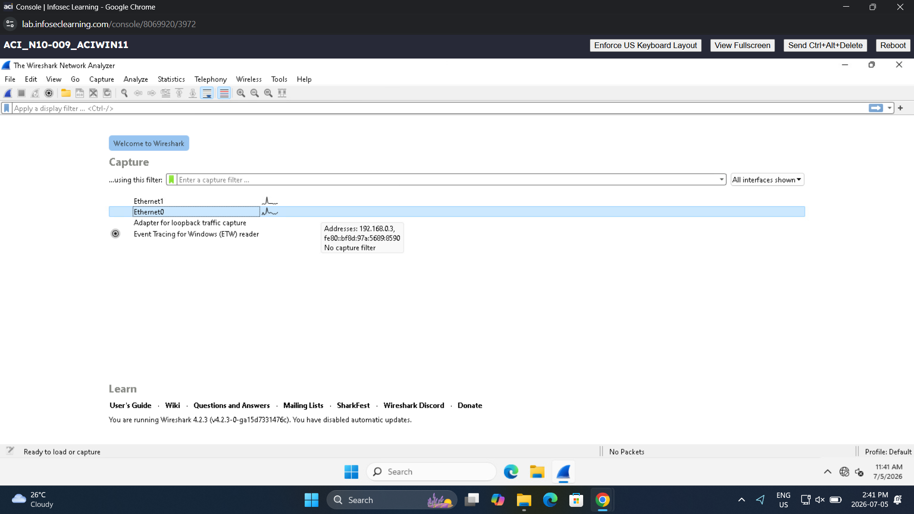

Background ARP broadcast traffic (`Who has 192.168.0.250?`) was visible from multiple local hosts before any DNS activity was generated.

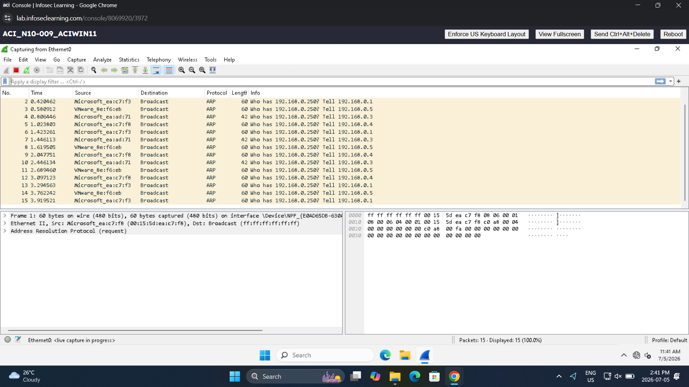

### 2. Generate a DNS Query via Command Prompt
Ran the following in an elevated Command Prompt:
```
nslookup acidc01
```
The initial lookup timed out ("DNS request timed out"), then resolved successfully on retry:
```
Server:   UnKnown
Address:  192.168.0.1

Name:     acidc01.aciplab.com
Address:  192.168.0.1
```

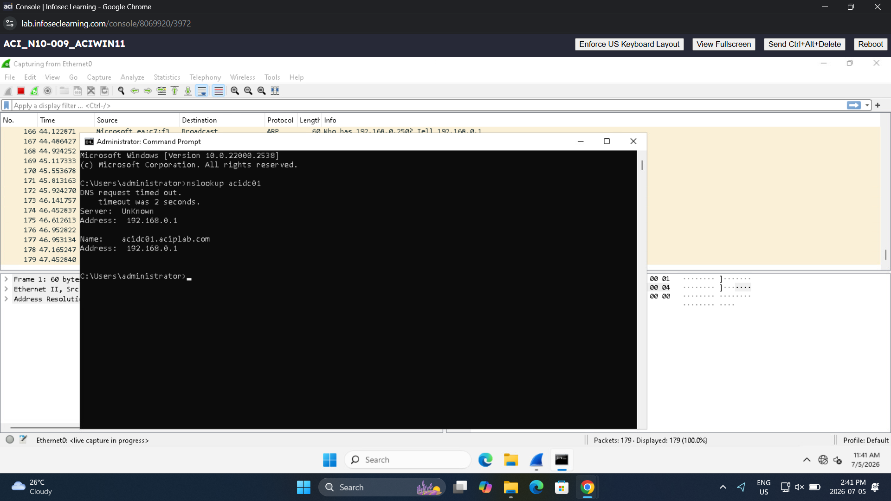

### 3. Filter Traffic
Applied the display filter `dns` in Wireshark to isolate query/response pairs from the noisy background ARP traffic, then selected the query for `wpad.aciplab.com` (Frame 37, Transaction ID `0x5a17`).

### 4. Analyze the Query (Frame 37)
Frame-level detail — timestamps, capture length, and arrival time:

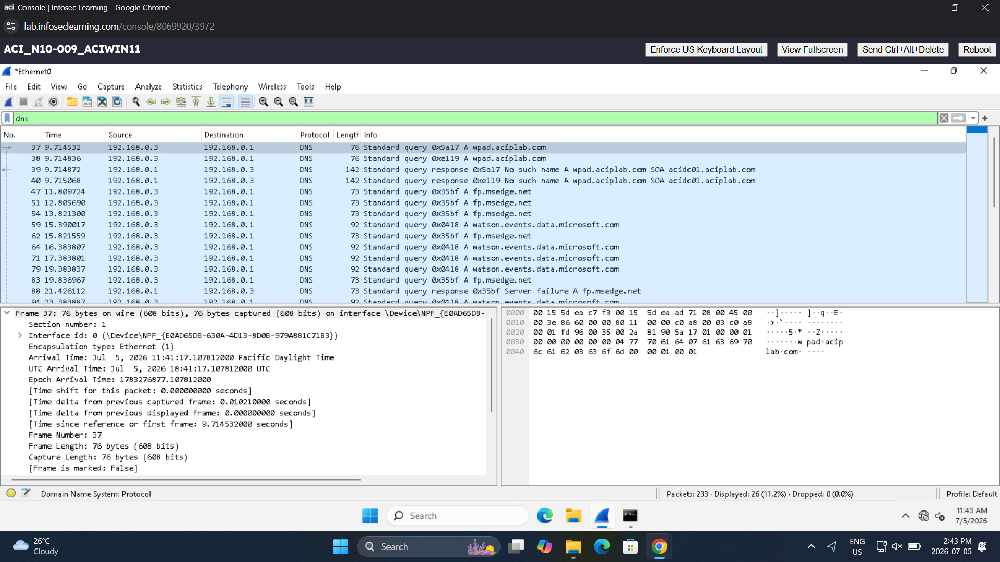

UDP layer — Source Port 64918 → Destination Port 53 (standard DNS port):

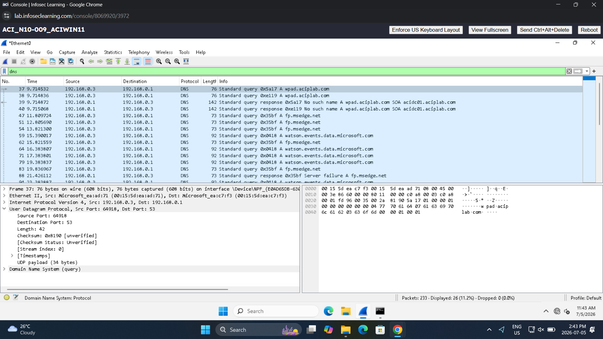

DNS layer — Transaction ID `0x5a17`, Standard query, recursion desired, Question: `wpad.aciplab.com` (Type A, Class IN):

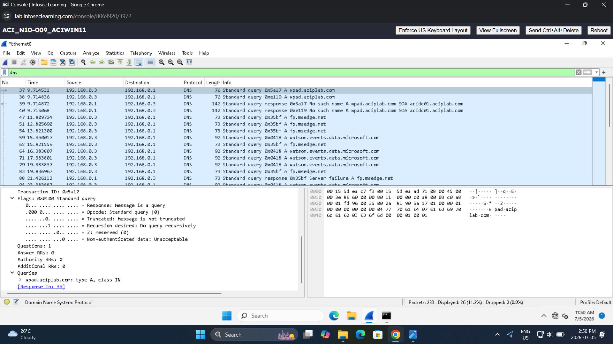

Expanded query flags breakdown:

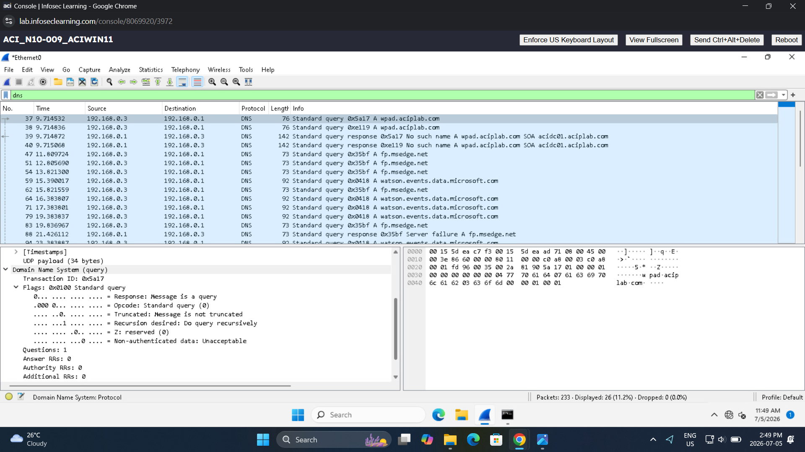

- **Ethernet II:** Src `00:15:5d:ea:ad:71` → Dst `00:15:5d:ea:c7:f3`
- **IPv4:** 192.168.0.3 → 192.168.0.1
- **UDP:** Src Port 64918 → Dst Port 53
- **DNS:** Transaction ID `0x5a17`, Flags `0x0100` (Standard query, recursion desired)

### 5. Analyze the Response (Frame 39)
Response flags showing the NXDOMAIN result:

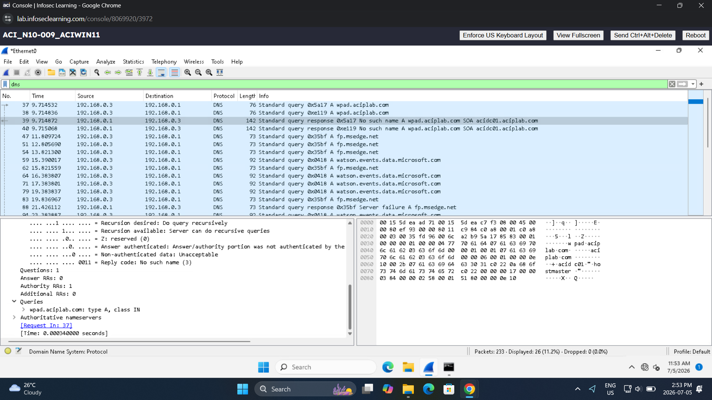

Full response detail — Answer/Authority record counts:

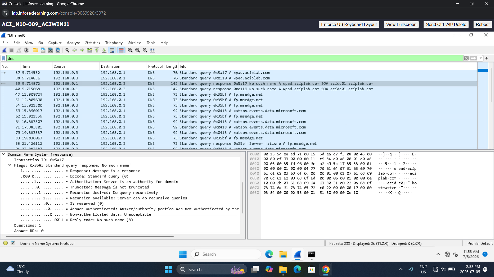

- Transaction ID matches: `0x5a17`
- Flags `0x8583`: Response, Authoritative, **Reply code: No such name (NXDOMAIN)**
- Answer RRs: 0 | Authority RRs: 1 (SOA: acidc01.aciplab.com)

**Interpretation:** `wpad.aciplab.com` does not exist in DNS — a normal, expected NXDOMAIN result for WPAD auto-discovery lookups in an environment with no configured WPAD proxy. The authoritative response confirms DNS resolution is functioning correctly end-to-end.

### Other Observations
Repeated background queries for `fp.msedge.net` and `watson.events.data.microsoft.com` (Windows/Edge telemetry) were also visible, some returning `Server failure`.

---

## Part 2 — HTTP Traffic Analysis

### 1. Filter Traffic
Applied the display filter `http` in Wireshark to isolate HTTP request/response pairs from background DNS/ARP traffic.

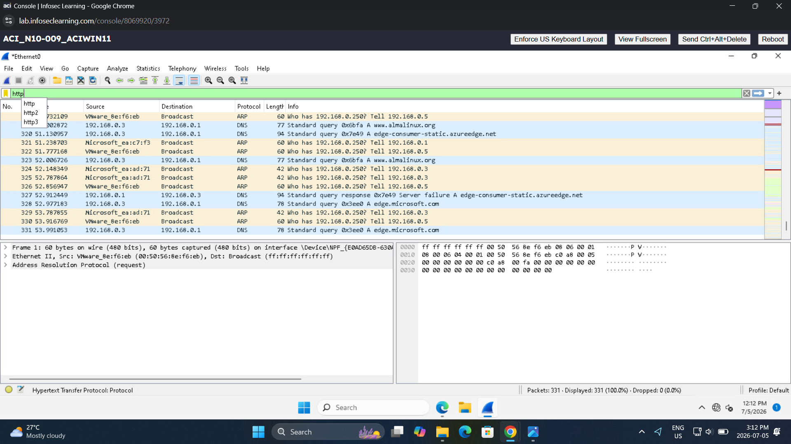

### 2. Browser Request
Navigated to `http://192.168.0.4/` in Chrome, generating **Frame 216**.

Protocol tree overview:

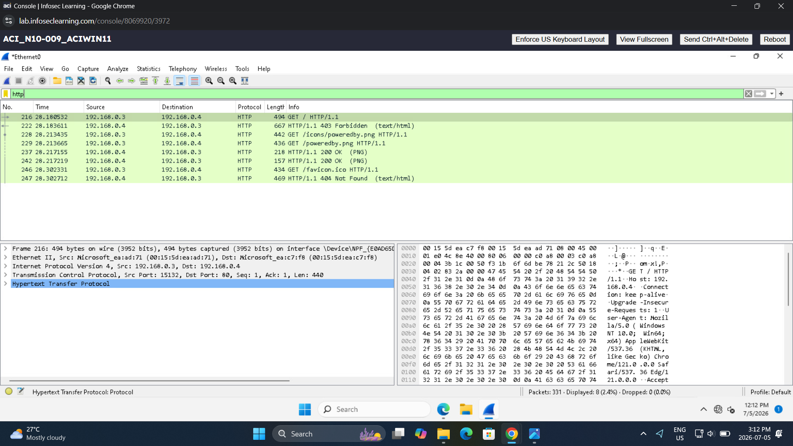

Frame-level detail:

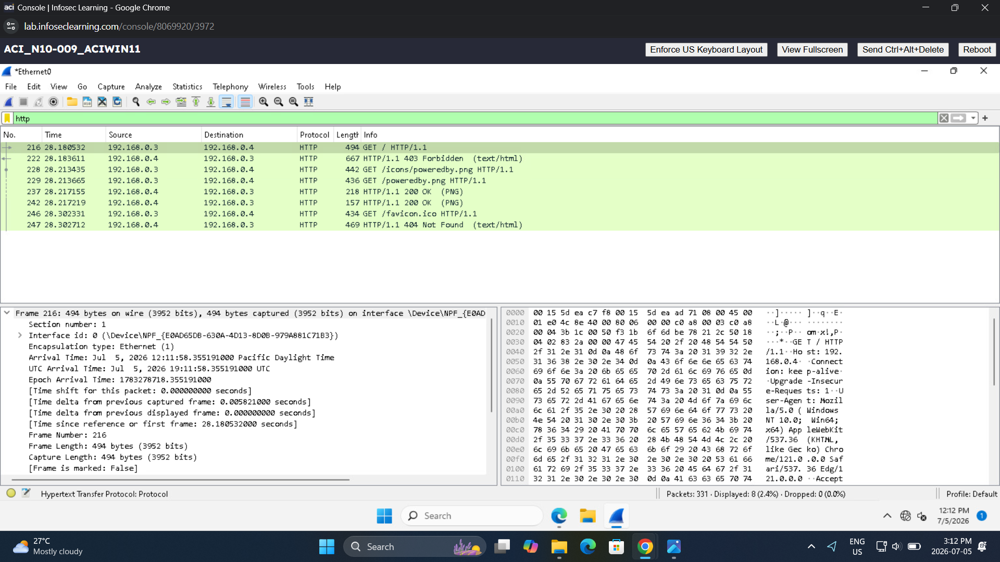

TCP layer — Source Port 15132 → Destination Port 80:

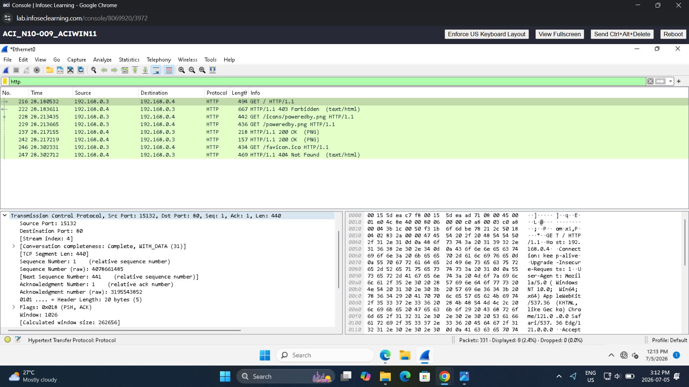

HTTP request headers:

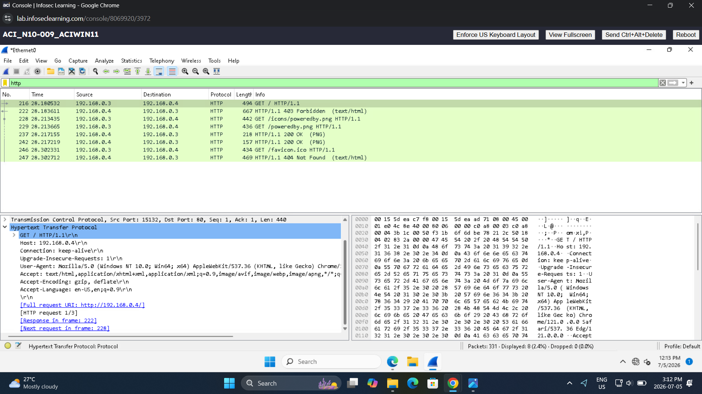

```
GET / HTTP/1.1
Host: 192.168.0.4
Connection: keep-alive
Upgrade-Insecure-Requests: 1
User-Agent: Mozilla/5.0 (Windows NT 10.0; Win64; x64) AppleWebKit/537.36 (KHTML, like Gecko) Chrome/121.0.0.0 Safari/537.36 Edg/121.0.0.0
Accept: text/html,application/xhtml+xml,application/xml;q=0.9,image/avif,image/webp,image/apng,*/*;q=0.8
Accept-Encoding: gzip, deflate
Accept-Language: en-US,en;q=0.9
```

### 3. Server Response (Frame 222)
Frame-level detail for the response:

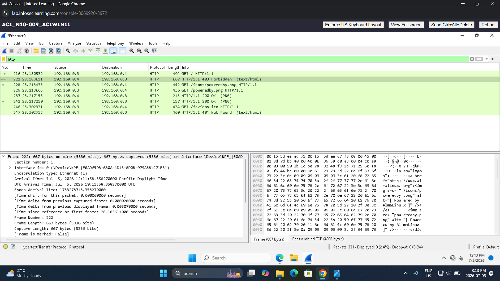

TCP layer — Source Port 80 → Destination Port 15132:

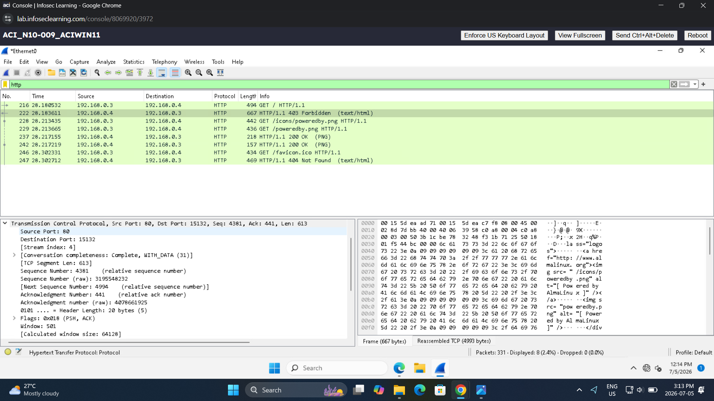

The response was reassembled across 4 TCP segments (frames 218–222), totaling 4993 bytes:

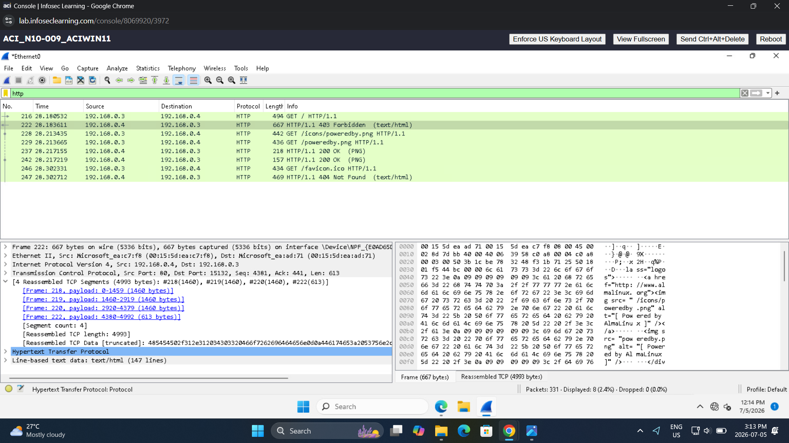

HTTP response headers:

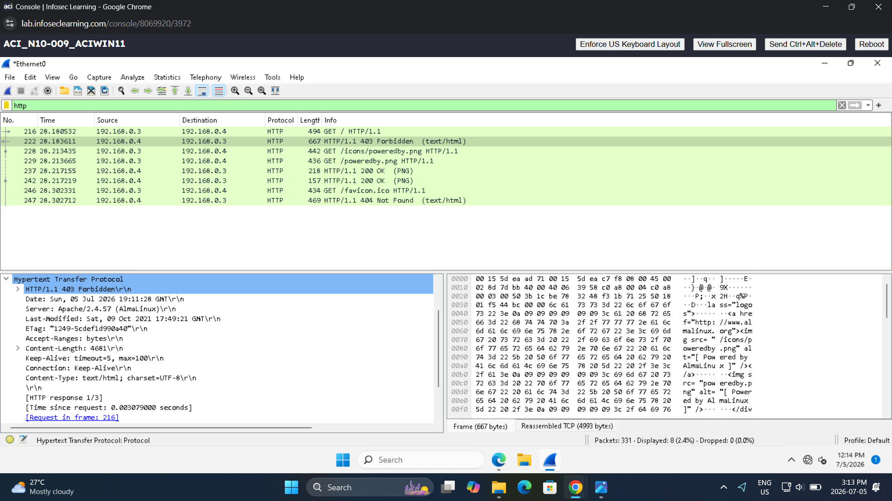

```
HTTP/1.1 403 Forbidden
Date: Sun, 05 Jul 2026 19:11:28 GMT
Server: Apache/2.4.57 (AlmaLinux)
Content-Type: text/html; charset=UTF-8
Content-Length: 4681
Connection: Keep-Alive
```

The response body contained full HTML markup for the default **Apache/AlmaLinux "Test Page"**, including references to `/icons/poweredby.png` and `/poweredby.png`.

**Note:** Although the server returned an HTTP status of **403 Forbidden**, it still delivered a valid HTML body (the standard AlmaLinux Apache welcome page). Browsers render whatever HTML is returned regardless of status code, so Chrome displayed the page content normally — a useful reminder that a "successful-looking" rendered page doesn't always mean a `200 OK` was returned underneath.

### 4. Follow-up Requests for Embedded Resources
The browser automatically requested the images referenced in the HTML body:

| Frame | Request | Response |
|---|---|---|
| 228 | `GET /icons/poweredby.png` | 237: `200 OK` (PNG) |
| 229 | `GET /poweredby.png` | 242: `200 OK` (PNG) |
| 246 | `GET /favicon.ico` | 247: `404 Not Found` (text/html) |

### 5. Visual Confirmation (Browser)
The rendered page confirmed the Apache test page content:

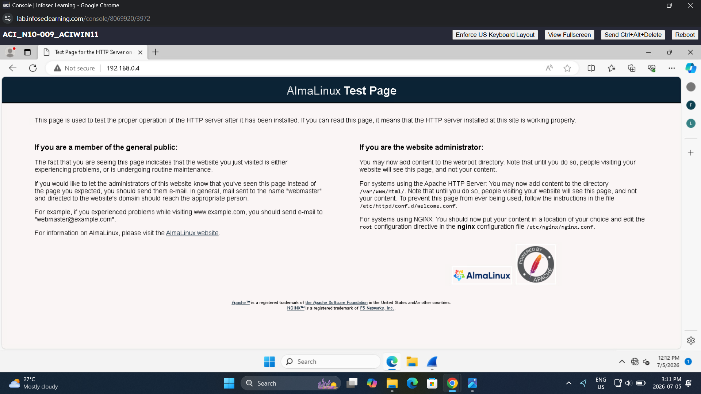

> "This page is used to test the proper operation of the HTTP server after it has been installed. If you can read this page, it means that the HTTP server installed at this site is working properly."

## Summary of Findings — Part 2
| Item | Detail |
|---|---|
| Client | 192.168.0.3 (ACIWIN11), port 15132 |
| Server | 192.168.0.4, Apache/2.4.57 (AlmaLinux), port 80 |
| Initial request | `GET /` |
| Initial response | `403 Forbidden` (but HTML body rendered) |
| Follow-up resources | 2× PNG (200 OK), 1× favicon (404 Not Found) |
| Protocol port | TCP/80 |

---

## Overall Conclusion
This two-part exercise reinforced core packet analysis skills across two protocols:

- **DNS (Part 1):** generating a query via `nslookup`, capturing it, and interpreting an NXDOMAIN response at the transaction/flag level.
- **HTTP (Part 2):** capturing a full browser-driven request/response cycle, reassembling TCP segments, reading HTTP headers, and reconciling an unexpected status code (403) with visually successful page rendering.

Together they demonstrate how Wireshark filters (`dns`, `http`) isolate relevant traffic and how drilling into the Ethernet → IP → TCP/UDP → Application layers reveals what's actually happening on the wire versus what a user sees on screen.
